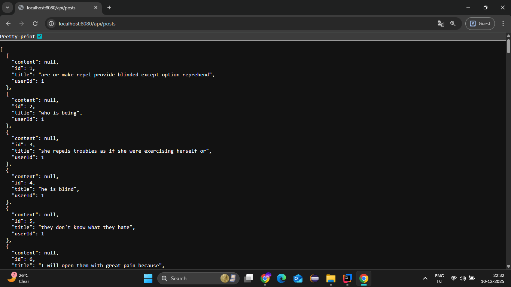
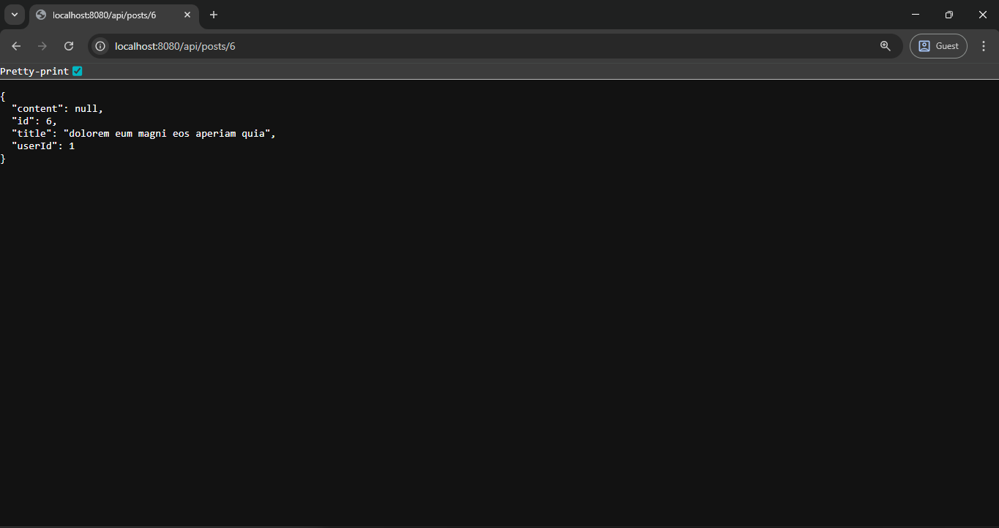

# API Integration Assignment – Spring Boot

This is a small assignment project where I fetch data from the public JSONPlaceholder API and expose simple REST endpoints after caching the data locally. 

## Public APIs Used
- https://jsonplaceholder.typicode.com/posts
- https://jsonplaceholder.typicode.com/users

## Features
- Fetch and cache API data into a local JSON file.
- List all posts.
- Filter posts by `userId`.
- Get a single post by ID.

## Endpoints
- GET `/api/posts`
- GET `/api/posts?userId=1`
- GET `/api/posts/{id}`

## How to Run the Project

1. Make sure you have Java 17+ and Maven installed.
2. Open the project folder in IntelliJ (or any IDE that supports Maven).
3. Wait for Maven to download all dependencies.
4. To run the project:
   - Open `GlobalTrendApplication.java`
   - Click the **Run** button.

## Sample Output

Below are a few sample responses from the API:

